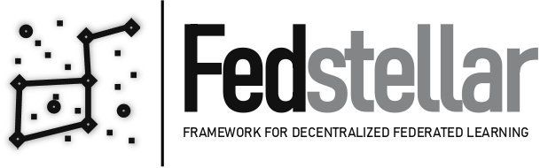

.. role:: raw-html(raw)
    :format: html

.. raw:: html

   <h1 align="center">
   Fedstellar
   </h1>

.. raw:: html

   <h2 align="center">
   A Framework for Decentralized Federated Learning
   </h2>

:raw-html:` `

Fedstellar is a modular, adaptable and extensible framework for creating centralized and decentralized architectures using Federated Learning. Also, the framework enables the creation of a standard approach for developing, deploying, and managing federated learning applications.

The framework enables developers to create distributed applications that use federated learning algorithms to improve user experience, security, and privacy. It provides features for managing data, managing models, and managing federated learning processes. It also provides a comprehensive set of tools to help developers monitor and analyze the performance of their applications.

Fedstellar is developed by `Enrique Tomás Martínez Beltrán <https://www.enriquetomasmb.com/>`_ in collaboration with the `University of Murcia <https://www.um.es/en>`_, `Armasuisse <https://www.armasuisse.ch/en>`_, and the `University of Zurich (UZH) <https://www.uzh.ch/>`_.

For any questions, please contact Enrique Tomás Martínez Beltrán (enriquetomas@um.es).

:raw-html:` `

.. image:: _static/umu.jpg
   :width: 200
   :alt: University of Murcia logo

.. image:: _static/armasuisse.jpg
   :width: 200
   :alt: Armasuisse logo

:raw-html:` `
:raw-html:` `

.. toctree::
   :maxdepth: 2
   :caption: Contents:

   installation
   autoapi/index

* :ref:`genindex`
* :ref:`modindex`

